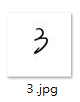
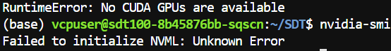

# <font class="h2">**SDT 執行筆記/北科AI運算平台V100**</font>


**Github:** https://github.com/dailenson/SDT?tab=readme-ov-file
！！！電腦要有 <font color="darkblue">**NVIDIA GPU**</font>！！！

### 說明: 

SDT 是使用 Online 資料集作為輸入（包含下筆點、起筆點、筆畫等等，他們放在 lmdb 檔，雖然他們的 input 也還是圖像，但那跟 lmdb 的內容是相對應的），所以我們的 offline 數據（圖像）沒辦法拿去訓練，但根據我的測試（把1020個字體中的240個字體圖像換成我在方正字庫下載的字體）結果還是有比較好的，推測是 SDT 使用的數據集 CASIA-CHINESE 的字體筆劃都太細，所以雖然我的圖片跟他的 lmdb 資料對不起來，但將部分字體換成筆畫比較正常（粗）的去重新訓練確實能夠改善訓練結果。

另外他的 test 是也是根據他的 lmdb，所以如果新增 data 在 test 裡面想要用 test.py 生成的話會報錯，要生成自己的字體就用 user_generate.py 就好。此外作者沒有提供他生成 lmdb 的程式碼，也沒有其數據的範例，lmdb 我也打不開，所以真的收集到 online 資料及可能也沒辦法用，請自行評估！


<br>

### 環境 & 套件

環境設置：
```
python 3.8
pytorch>=1.8（我使用 1.12.1）
CUDA 11.3.1
```

套件安裝：
```
conda create --name SDT python=3.8
conda activate SDT
pip install -r requirements.txt

**requirements.txt 的內容物**

Six
numpy
packaging 
pyyaml 
pillow 
lmdb 
tqdm 
Fastdtw 
tensorboardX 
easydict==1.9 
einops==0.4.1 
chardet
opencv-python

**requirements.txt 的內容物**

conda install pytorch==1.12.1 torchvision==0.13.1 torchaudio==0.12.1 cudatoolkit=11.3 -c pytorch
sudo apt-get install libgl1-mesa-glx（出現 error 就先 sudo apt-get update）
conda install glib


```
CUDA 及 Pytorch 版本對應關係可參考：
https://pytorch.org/get-started/previous-versions/

<br>

### 資料 & 架構
* 資料集：
https://drive.google.com/drive/folders/17Ju2chVwlNvoX7HCKrhJOqySK-Y-hU8K
* Pre-trained content encoder：
https://drive.google.com/drive/folders/1N-MGRnXEZmxAW-98Hz2f-o80oHrNaN_a
* Well-trained SDT model：[https://drive.google.com/drive/folders/1LendizOwcNXlyY946ThS8HQ4wJX--YL7](https://drive.google.com/drive/folders/1LendizOwcNXlyY946ThS8HQ4wJX--YL7)

```
SDT/
│
├── train.py - main script to start training
├── test.py - generate characters via trained model
├── evaluate.py - evaluation of generated samples
│
├── configs/*.yml - holds configuration for training
├── parse_config.py - class to handle config file
│
├── data_loader/ - anything about data loading goes here
│   └── loader.py
│
├── model_zoo/ - pre-trained content encoder model
│
├── data/ - default directory for storing experimental datasets
│   ├── CASIA_ENGLISH/
│   └── CASIA_CHINESE/
│
│
├── model/ - networks, models and losses
│   ├── encoder.py
│   ├── gmm.py
│   ├── loss.py
│   ├── model.py
│   └── transformer.py
│
├── saved/
│   ├── models/ - trained models are saved here
│   ├── tborad/ - tensorboard visualization
│   └── samples/ - visualization samples in the training process
│
├── trainer/ - trainers
│   └── trainer.py
│  
└── utils/ - small utility functions
    ├── util.py
    └── logger.py - set log dir for tensorboard and logging output
```
    
<br>

### 如果需要讀取 pkl 內容或者進行檔案的轉換，可以執行我資料夾放的程式碼（叫 mycode）

<br>

### 生成指定字符

在 v100 放入 zip 檔，可以輸入 unzip xxx.zip 來解壓縮
<br>
### 生成指定字符 + 將 ttf 轉 jpg
* 將要生成的字符放在 extracted_words.txt 中
* 執行 python font2img_extract.py，跑完以後應該就有pkl檔，那就是 Chinese_content.pkl
    * --ttf_path ttf檔存放位置
    * --chara 訓練指定字符的 txt 檔
    * --save_path 存圖片的資料夾
    * --img_size 指定圖片大小
    * --chara_size 指定字型大小
ex：　
`python font2img_extract.py --ttf_path ttfs --chara extracted_words.txt --save_path imgs --img_size 64 --chara_size 55`


必須先提供標準字符，更改 Chinese_content.pkl 檔案，再將想生成的字的 unicode 放進 Chracter_dict.pkl 中（可執行 word_to_unicode.py 來獲得 json 檔，去頭去尾執行 json_to_pkl.py 即可得到）


<br>

### 生成：user_generate.py
先將圖片命名為字符本人，放進 --style_path 的 folder 中，如下：


> 如果你的圖片檔名原本是 unicode，可以使 filename_translate.py 來讀取 unicode 並重新命名。如果圖片需要 resize 可使用 resize_to_jpg.py 更改圖片大小為 64*64。

用 v100 跑，user_generate.py 要加入：
```
import ssl
ssl._create_default_https_context = ssl._create_unverified_context
```
**並將 num_workers 設置為 0**

* 如果要生成英文的手寫字體：
`
python user_generate.py --pretrained_model saved/english/saved_weights/checkpoint-iter91999.pth --style_path data/CASIA_ENGLISH/test_myfont --cfg configs/English_User.yml --dir Generated/English_User
`

* 如果要生成中文的手寫字體：
`
python user_generate.py --pretrained_model saved/chinese/saved_weights/checkpoint-iter199999.pth --style_path data/CASIA_CHINESE/chinese_myfont --cfg configs/Chinese_User.yml --dir Generated/Chinese_User
`

### 可能會遇到的問題
* v100 容器閒置太久（maybe 5-6 天）會找不到 cuda，也沒辦法顯示顯卡資訊，必須要重新建立容器。

